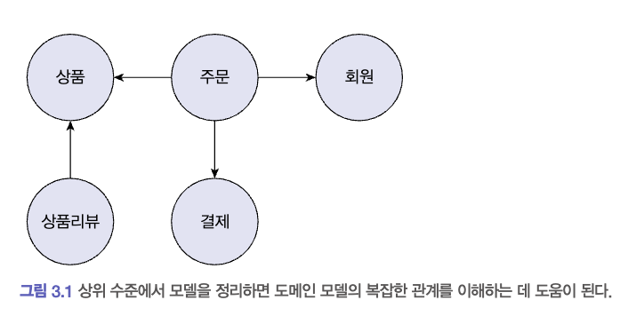
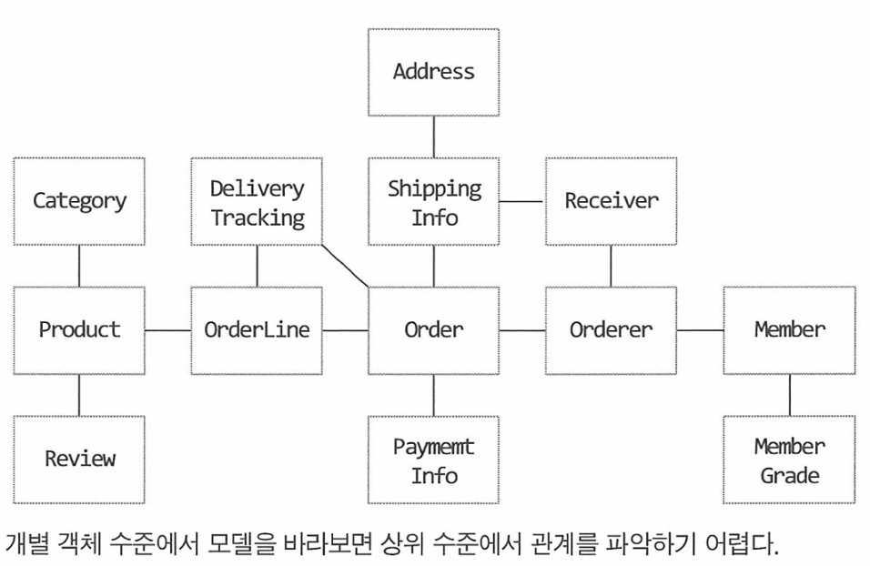
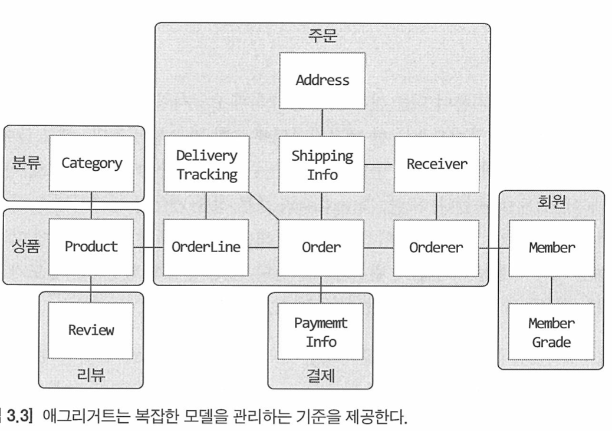
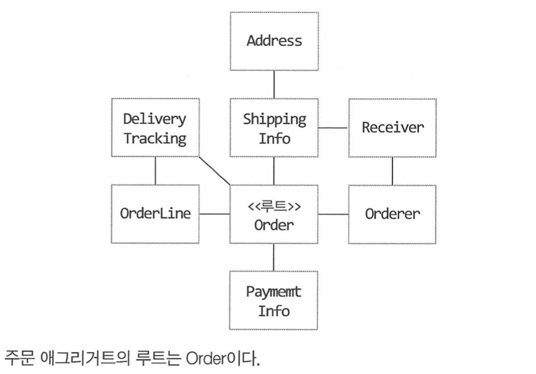

# Aggregate
- 상위 수준 개념을 이용해서 전체 모델을 정리하면 전반적인 관계를 이해하는 데 도움이 된다.
- 개별 객체 수준에서 모델을 바라보면 전체 모델을 이해하는 데 어려움이 있다.
- 복잡한 도메인을 이해하고 관리하기 쉬운 단위로 만들려면 상위 수준에서 모델을 조망할 수 있는 방법이 필요하다.
  - `Aggreagte`는 관련된 객체를 하나의 군으로 묶어준다.




## Aggregate 특징
- `Aggregate`와 그에 속한 객체는 유사하거나 동일한 라이프 사이클을 갖는다.
  - 주문 Aggregate를 만들기 위해서는,
    - Order, OrderLine, Orderer와 같은 관련 객체를 함께 생성해야 한다.
- `Aggregate`는 위 그림에서 보는것 처럼 경계를 갖는다.
  - 한 `Aggregate`에 속한 객체는 다른 `Aggregate`에 속하지 않는다.
  - `Aggregate`는 독립된 군이며, 오로지 자기 자신을 관리할 뿐, 다른 `Aggregate`는 관리하지 않는다.

# Aggregate Root
- `Aggregate`에 속한 모든 객체가 일관된 상태를 유지하려면 `Aggregate` 전체를 관리할 주체가 필요하다.
  - 이 책임을 지는 것이 바로 `Aggregate Root`이다.
- `Aggregate`에 속한 객체는 `Aggregate Root`에 직접 또는 간접적으로 속하게 된다.



## Aggregate Root 역할
- 도메인 규칙에 따라 `Aggregate`의 일관성이 깨지지 않아야 한다.
- `Aggregate`가 제공해야 할 도메인 기능을 구현한다.

```java
public class Order {
    
    // Aggregate Root는 도메인 규칙을 구현한 기능을 제공한다.
    public void changeShippingInfo(ShippingInfo newShippingInfo) {
        verifyNotYetShipped();
        setShippingInfo(newShippingInfo);
    }
    
    private void verifyNotYetShipped() {
        if (state != OrderState.PAYMENT_WAITING && state != OrderState.PREPARING) {
            throw new IllegalStateException("already shipped");
        }
    }
}
```

### Aggregate 구현시 주의사항
> **_단순히 필드를 변경하는 set 메서드를 public 범위로 만들지 않는다._**
> 
> **_`Value` 타입은 불변으로 구현한다._** `Value` 타입 데이터를 변경할 때는 객체 자체를 완전히 교체한다.
- Aggregate 외부에서 Aggregate에 속한 객체를 직접 변경하면 안 된다.
  - 데이터 일관성이 꺠지게 된다.

```java
ShippingInfo shippingInfo = order.getShippingInfo();
shippingInfo.setAddress(newAddress);
```

### Aggregate Root의 기능 구현
- Aggregate Root는 Aggregate 내부의 다른 객체를 조합해서 기능을 완성한다.

```java
public class Order {
    private Money totalAmounts;
    private List<OrderLine> orderLines;
    
    private void calculateTotalAmounts() {
        int sum = orderLines.stream()
                .mapToInt(orderLine -> orderLine.getPrice() * orderLine.getQuantity())
                .sum();
        
        this.totalAmounts = new Money(sum);
    }
}
```

- Aggregate Root가 구성요소의 상태만 참조하는 것은 아니다.
- 기능 실행을 위임하기도 한다.

```java
public class OrderLines {
    private List<OrderLine> lines;
    
    public Money getTotalAmounts() { 
        // ...
    }
    
    // public일 경우, 외부에서 OrderLines의 상태를 변경할 수 있다.
    // 오로지 Aggregate Root에서만 변경할 수 있게끔, package 혹은 protected로 설정한다.
    protected void changeOrderLines(List<OrderLine> newLines) {
        this.lines = newLines;
    }
}
```

```java
public class Order {
  private Money totalAmounts;
  private OrderLines orderLines;

  public void changeOrderLines(List<OrderLine> newLines) {
    orderLines.changeOrderLines(newLines);
    this.totalAmounts = orderLines.calculateTotalAmounts();
  }
}
```

### Aggregate의 Transaction 범위
- 가급적이면 한 Transaction에서는 하나의 Aggregate만 수정한다.
  - 여러 Aggregate를 수정해야 한다면, `Application` 영역에서 여러 Aggregate를 수정하도록 구현하는 걸 권장한다.
- Domain 이벤트를 사용하면, 한 Transaction에서 한 개의 Aggregate를 수정하면서도 동기나 비동기로 다른 Aggregate의 상태를 변경하는 것이 가능하다.

# Repository, Aggregate
- Aggregate는 개념상 완전한 한 개의 도메인 모델을 표현하므로,
  - 객체의 영속성을 처리하는 `Repository`는 Aggregate 단위로 존재한다.
- `Repository`는 기본적으로 Aggregate를 저장하고 조회하는 기능을 제공한다.
  - save
  - findById
  - 그 외에 검색, 삭제 메서드를 추가할 수 있다.
- Aggregate는 개념적으로 하나 이므로, `Repository`는 Aggregate 전체를 저장소에 영속화해야한다.

# ID를 이용한 Aggregate 참조

# Aggregate 간 집합 연관

# Aggregate를 Factory로 사용하기
- 특정 상점이 고객에게 신고당할 경우, Block 된다고 가정하자.
- 상점이 Block 상태가 아닌 경우에만 신규 상품을 생성할 수 있도록 구현해보자.

```java
public class RegisterProductService {
    public ProductId registerNewProduct(NewProductRequest req) {
        Store store = storeRepository.findById(req.getStoreId());
        
        checkNull(store);
        
        // Store가 Blocked 상태인지 확인
        if (store.isBlocked()) {
            throw new StoreBlockedException();
        }
        
        // Store가 신규 Product 생성
        ProductId productId = productRepository.nextId();
        Product product = new Producct(productId, store.getId(), ...);
        productRepository.save(product);
        return product.getId();
    }
}
```

- 위 코드는 아래 2가지 코드가 분리되어 있다.
  - Store가 신규 Product을 생성할 수 있는지 판단 (Block 상태인지 아닌지 확인)
  - Store가 신규 Product 생성 

## 내부 Aggregate 객체에게 위임하거나 다른 Factory에게 위임하기
```java
public class Store {
    public Product createProduct(ProductId productId, ProductInfo productInfo) {
        if (isBlocked()) {
            throw new StoreBlockedException();
        }
        
//        return new Product(productId, this.id, productInfo);
      return ProductFactory.create(productId, this.id, productInfo);
    }
}
```

```java
public class RegisterProductService {
    public ProductId registerNewProduct(NewProductRequest req) {
        Store store = storeRepository.findById(req.getStoreId());
        
        checkNull(store);
        
        ProductId productId = productRepository.nextId();
        Product product = store.createProduct(productId, ...);
        productRepository.save(product);
        return product.getId();
    }
}
```
