# 도메인 모델과 경계
- 한 도메인은 다시 여러 하위 도메인으로 구분된다.
- 한 개의 도메인 모델로 여러 하위 도메인을 모두 표현하려고 시도하면, 오히려 모든 하위 도메인에 맞지 않는 모델을 만들게 된다.

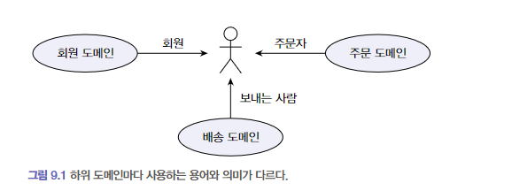

- 하위 도메인마다 같은 용어라도 의미가 다르고 같은 대상이라도 지칭하는 용어가 다를 수 있다.
- 하위 도메인마다 모델을 분리해서 구현해야 한다.
  - 모델은 특정한 Context 하에서 완전한 의미를 갖는다.

# BoundedContext
- BoundedContext는 모델의 경계를 결정한다.
- 한 개의 BoundedContext는 논리적으로 한 개의 모델을 갖는다.
  - 현실적으로는 그렇지 않을때도 있다.

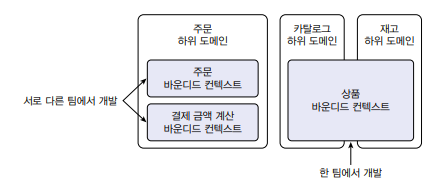

<br/>

- 물리적인 BoundedContext가 한 개 이더라도
  - 내부적으로 Package를 활용해서 논리적으로 BoundedContext를 만든다.
  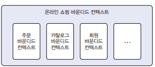

<br/>

- BoundedContext는 각자 구현하는 하위 도메인에 맞는 모델을 갖는다.
- BoundedContext는 도메인 모델을 구분하는 경계가 되기 때문에
  - BoundedContext는 구현하는 하위 도메인에 알맞은 모델을 포함한다.
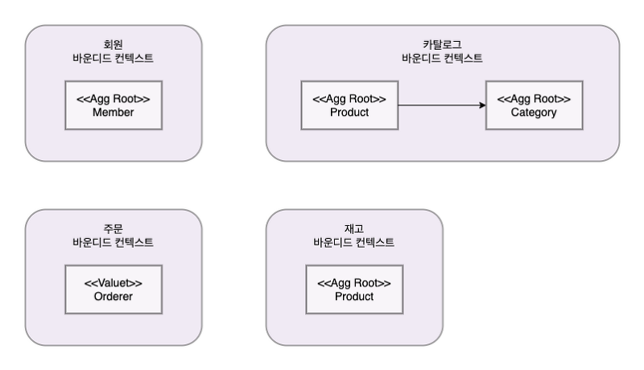

# BoundedContext 구현
- BoundedContext는 도메인 기능을 사용자에게 제공하는 데 필요한 모든 요소를 포함한다.
  - `Presentation`
  - `Application`
  - `Domain Service`
  - `Infrastructure`

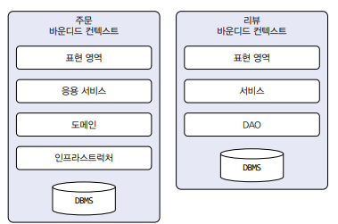

## CQRS
> Command Query Responsibility Segregation
> 
> 명령 기능과 쿼리 기능을 위한 모델을 구분하는 패턴

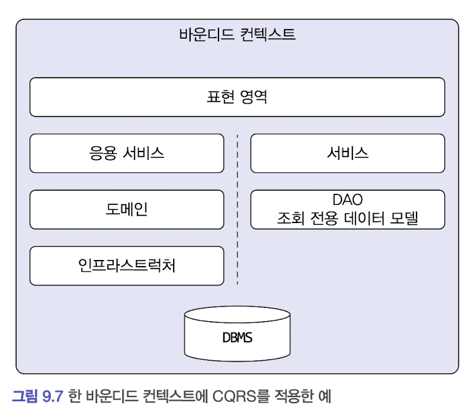

# BoundedContext 간 통합

- 서로 연관된 두 BoundedContext 간에는 통합이 필요하다.
  - 예시
    - 사용자가 제품 상세 페이지를 볼 때, 보고 있는 상품과 유사한 상품 목록을 하단에 보여준다.
    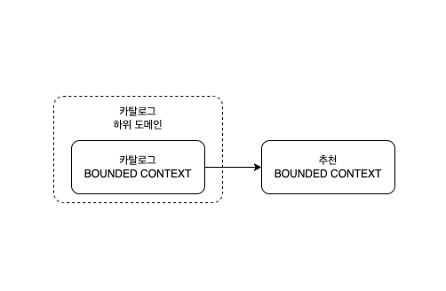

## 예시
- 외부 연동을 위한 도메인 서비스 구현 클래스는 도메인 모델과 외부 시스템 간의 모델을 변환을 처리한다.
```java
public interface ProductRecommendationService {

    List<Product> getRecommendationsOf(ProductId productId);
}
```
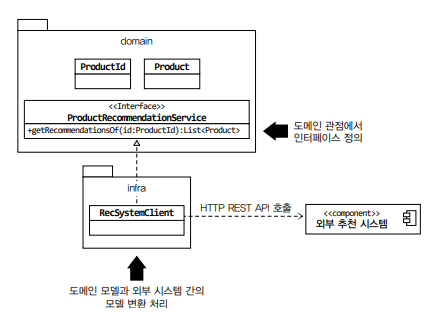

```java
public class RecommendationSystemClient implements ProductRecommendationService {
    private ProductRepository productRepository;
    
    @Override
    public List<Product> getRecommendationsOf(ProductId productId) {
        List<RecommendationItem> items = getRecommendationItems(id.getValue());
        return toProducts(items);
    }
    
    private List<RecommendationItem> getRecommendationItems(String itemId) {
        // externalRecommendationClient는 외부 추천 시스템을 위한 클라이언트
        return externalRecommendationClient.getRecommendationItems(itemId);
    }
    
    private List<Product> toProducts(List<RecommendationItem> items) {
        return items.stream()
            .map(item -> toProductId(item.getItemId()))
            .map(productId -> productRepository.findById(productId))
            .toList();
    }
    
    private ProductId toProductId(String itemId) {
        return new ProductId(itemId);
    }
}
```

# BoundedContext 간 관계

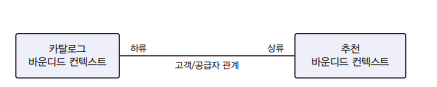

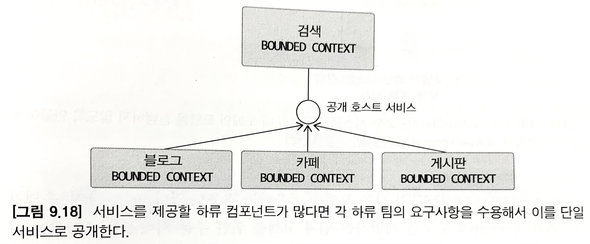

# 컨텍스트 맵
- 개별 BoundedContext에 매몰되면 전체를 보지 못할 때가 있다.
- 전체 비지니스를 조망할수 있는 컨텍스트 맵을 그려보자.

## OHS
> Open Host Service

## ACL
> Anti Corruption Layer

- 외부 시스템의 도메인 모델이 특정 도메인 모델을 침범하지 않도록 막아주는 역할을 하는 계층
  - 도메인 내부에 자체적으로 외부 시스템의 서비스를 위한 인터페이스를 정의하는 것

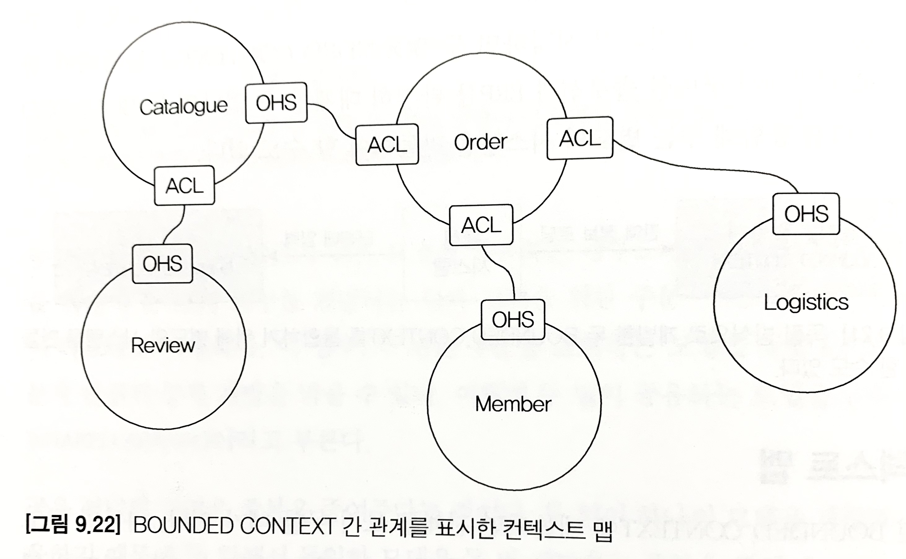
