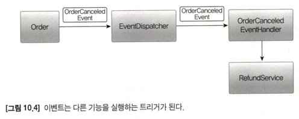
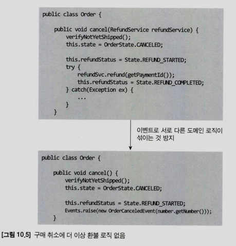
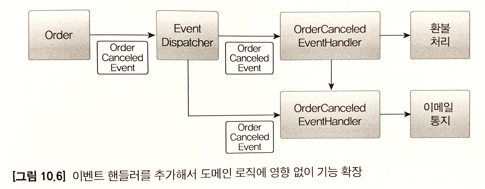
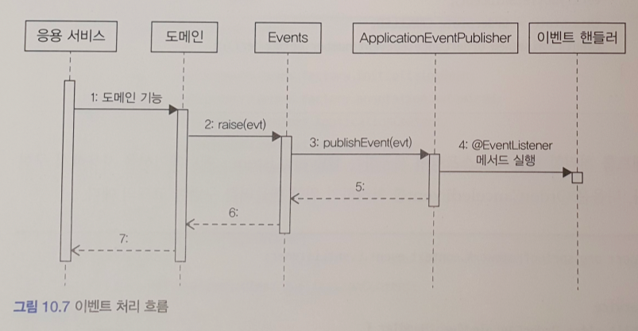
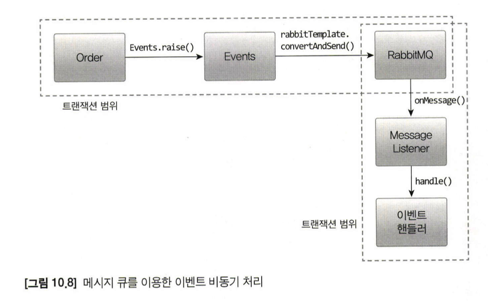
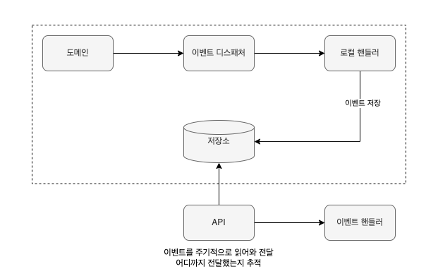
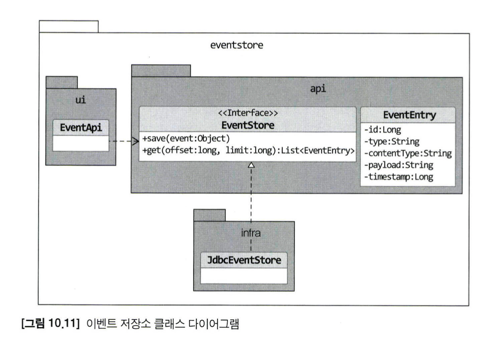

# 시스템 간 강결합(High Coupling) 문제
- 쇼핑몰에서 구매를 취소하면, 환불을 처리해야한다.
- 이때 환불 기능을 실행하는 주체는 주문 도메인 엔티티가 될 수 있다.
- 도메인 객체에서 환불 기능을 실행하려면
  - 다음 코드처럼 환불 기능을 제공하는 도메인 서비스를 파라미터로 전달받고, 취소 도메인 기능에서 환불 기능을 실행하게 된다.

```java
public class Order {
    // 환불 관련 외부 서비스를 실행하기 위해, 파라미터로 전달 받음
    public void cancel(RefundService refundService) {
        // 주문 취소 로직
        verfiyNotYetShipped();
        setStatus(OrderState.CANCELED);
        
        // 결제 환불 로직
        setRefundStatus(RefundStatus.REFUND_STARTED);
        try {
            refundService.refund(getPaymentId());   // 외부 서비스 성능에 영향 받음
            setRefundStatus(RefundStatus.REFUND_COMPLETED);
        } catch (Exception e) {
            // ...
        }
    }
}
```

- `Application` 영역의 서비스에서 환불 기능을 실행할 수도 있다.

```java
public class CancelOrderService {

    private RefundService refundService;

    @Transactional
    public void cancelOrder(OrderNo orderNo) {
        Order order = orderRepository.findById(orderNo)
            .orElseThrow(() -> new OrderNotFoundException(orderNo));
        
        // 주문 취소 로직
        order.cancel();
        
        // 결제 환불 로직
        try {
            refundService.refund(order.getPaymentId());     // 외부 서비스 성능에 영향 받음
            order.refundCompleted();
        } catch (Exception e) {
            // ...
        }
    }
}
```

## Bounded Context 간 High Coupling 문제점
- 다른 도메인 서비스가 정상이 아닐 경우, Transaction 처리를 어떻게 해야할지 애매함.
- 다른 도메인 서비스의 성능에 직접적인 영향을 받음.

## 해결 방법
- 도메인 서비스를 직접 호출하는 것이 아니라, 도메인 `Event`를 사용해서 도메인 서비스를 실행하도록 구현한다.
  - 두 도메인 서비스 간의 결합을 크게 낮출 수 있다.

# Event
- 도메인 모델에서 발생하는 이벤트를 `도메인 이벤트(Domain Event)`라고 한다.
- 도메인 모델에서도 UI 컴포넌트와 유사하게 도메인의 상태 변경을 이벤트로 표현할 수 있다.

## Event 관련 구성 요소
- `Event Publisher` : Event를 발생시키는 주체
- `Event Subscriber` : Event를 구독하는 주체
- `Event Dispatcher` : Event Publisher가 발생시킨 Event를 Event Subscriber에게 전달하는 역할
  - 구현방식에 따라 동기 / 비동기로 구현할 수 있다.
- `Event Handler` : Event Subscriber가 Event를 처리하는 로직

## Event 구성 요소
- **이벤트 종류**
  - 클래스 이름으로 이벤트 종류를 표현
- **이벤트 발생 시간**
- **추가 데이터**

```java
public record ShippingInfoChangedEvent(
    String orderNumber,
    long timestamp,
    ShippingInfo newShippingInfo
) {
  public ShippingInfoChangedEvent(String orderNumber, ShippingInfo newShippingInfo) {
    this(orderNumber, System.currentTimeMillis(), newShippingInfo);
  }
}
```

###  Event 발생 코드 예시
- `Events.raise()` 는 `Event Dispatcher`를 통해 이벤트를 전파하는 기능을 제공한다.

```java
import com.myshop.common.event.Events;

public class Order {

  public void changeShippingInfo(ShippingInfo shippingInfo) {
    verifyNotYetShipped();
    setShippingInfo(shippingInfo);
    Events.raise(new ShippingInfoChangedEvent(getNumber(), shippingInfo));  // Event Dispatcher 호출
  }
}
```

### Event Handler 코드 예시
- `Event Dispatcher`로부터 이벤트를 전달받아, 필요한 작업을 수행한다.

```java
public class ShippingInfoChangedHandler {

  @EventListener(ShippingInfoChangedEvent.class)
  public void handle(ShippingInfoChangedEvent event) {
    shippingInfoSynchronizer.sync(event.getOrderNumber(), event.getNewShippingInfo());
  }
}
```

## Event 용도
- Event는 크게 2가지 용도로 쓰인다.
  - Event Trigger : 도메인의 상태가 바뀔 때, 후처리 실행
  - 서로 다른 시스템 간의 데이터 동기화



## Event의 장점
- 서로 다른 도메인 간의 로직이 섞이는 것을 방지할 수 있다.
- Event Handler를 추가해서 도메인 로직에 영향없이 기능 확장이 가능하다.





# Event, Event Handler, Event Dispatcher 구현
- `Event` : 이벤트를 표현한다.
- `Event Dispatcher` : 스프링이 제공하는 `ApplicationEventPulisher`를 사용해서 구현한다.
- `Events` : 이벤트를 발행한다. `ApplicationEventPublisher`를 사용해서 이벤트를 발행한다.
- `Event Handler` : 이벤트를 수신해서 처리한다. 스프링에서 제공하는 `@EventListener`를 사용해서 구현한다.

## Event 클래스 구현
- 모든 이벤트가 발생 시간을 갖도록 하려면, 상위 추상 클래스를 만들고, 각 이벤트 클래스가 상속받도록 할 수 있다.

```java
public abstract class Event {
    @Getter
    private long timestamp;
    
    public Event() {
        this.timestamp = System.currentTimeMillis();
    }
}
```

```java
public class OrderCanceledEvent extends Event { 
    private String orderNumber;
    
    public OrderCanceledEvent(String orderNumber) {
        super();
        this.orderNumber = orderNumber;
    }
}
```

## EventDispatcher 구현
- 스프링에서 제공하는 `ApplicationEventPublisher`를 사용해서 구현한다.
- `Events.raise()` 메서드를 통해, 이벤트를 발생시킬 수 있다.

```java
@NoArgsConstructor(access = AccessLevel.PRIVATE)
public class Events {
    private static ApplicationEventPublisher publisher;

    public static void setPublisher(ApplicationEventPublisher publisher) {
        Events.publisher = publisher;
    }

    public static void raise(Object event) {
        if (publisher != null) {
            publisher.publishEvent(event);
        }
    }
}
```

```java
@Configuration
public class EventsConfiguration {
    @Autowired
    private ApplicationContext applicationContext;

    @PostConstruct
    public void init() {
      Events.setPublisher(applicationContext);
    }
}
```

## Event Handler 구현
- `ApplicationEventPulisher.publishEvent()` 메서드가 실행되면,
  - 스프링은 Event 클래스 값을 갖는 `@EventListener` 어노테이션이 붙은 메서드를 찾아서 실행한다.

```java
@Service
public class OrderCanceldEventHandler {
    private RefundService refundService;
    
    @EventListener(OrderCanceledEvent.class)
    public void handle(OrderCanceledEvent event) {
      refundService.refund(event.getOrderNumber());
    }
}
```

## 흐름 정리
- Sequence Diagram을 보면, 응용 서비스와 동일한 Transaction 범위에서 Event Handler가 실행하고 있다.
- 즉, 도메인 상태 변경과 Event Handler는 같은 Transaction 범위에서 실행된다.
  - **_왜냐하면 Event 처리를 동기 방식으로 구현했기 때문이다._**



# 동기 Event 처리 문제 
- 이벤트 처리하는 부분에 대한 성능 문제가 발생할 수 있다.
- 이벤트 처리하는 부분에서 예외가 발생했을 때, 예외를 처리에 대한 문제가 발생할 수 있다.
  - 주문 취소하다가 환불 처리가 예외가 발생했다고 가정하자.
  - 그러면 주문 취소도 롤백 시켜야 하는가?
  - 주문 취소는 정상적으로 반영하고, 환불 처리를 재시도하는 방식이 좋을 수도 있다.

## 해결 방법
- Event를 비동기로 처리
- Event와 Transaction을 연계

# 비동기 Event 처리
- `A 하면 일정 시간 안에 B 하라`
  - `A 하면` : Event 발생
  - `일정 시간 안에 B 하라` : Event Handler 비동기 실행 (별도의 스레드로 실행)

<br/>

- Event를 비동기로 구현할 수 있는 방법은 다양하다. 대표적으로 다음 4가지 방법이 있다.
  - 로컬 핸들러를 비동기로 실행하기
  - 메시지 큐를 사용하기
  - 이벤트 저장소와 이벤트 포워더 사용하기
  - 이벤트 저장소와 이벤트 제공 API 사용하기

## 로컬 핸들러를 통한 이벤트 비동기 처리 : @EnableAsync, @Async
- Event Handler를 별도 스레드로 실행하는 방법
- 스프링에서 제공하는 `@EnableAsync`, `@Async`를 사용해서 구현한다.
  - `@EnableAsync` 어노테이션을 사용해서 비동기 기능을 활성화한다.
  - Event Handler aptjemdp `@Async` 어노테이션을 설정한다.

```java
public class OrderCanceledEventHandler {

    private RefundService refundService;

    @Async
    @EventListener(OrderCanceledEvent.class)
    public void handle(OrderCanceledEvent event) {
        refundService.refund(event.getOrderNumber());
    }
}
```

## 메시지 큐를 이용한 이벤트 비동기 처리
- Kafka, RabbitMQ, ActiveMQ 등의 메시지 큐를 사용해서 구현한다.


## 이벤트 저장소를 이용한 이벤트 비동기 처리
- Event를 일단 DB에 저장한 뒤에 별도 프로세스를 이용해서 Event Handler에 전달하는 방법

### 이벤트 저장소와 이벤트 포워더를 통한 구현


### 이벤트 저장소와 API를 통한 구현


### 이벤트 저장소 구현
- `EventEntry` : 이벤트 저장소에 보관할 데이터이다.
  - `id` : 이벤트 식별자
  - `type` : 이벤트 타입
  - `contentType` : 직렬화한 데이터 형식
  - `payload` : 이벤트 데이터, Event 객체를 직력화해서 저장한다.
  - `timestamp` : 이벤트 발생 시간
- `EventStore` : 이벤트를 저장하고 조회하는 인터페이스
- `JdbcEventStore` : JDBC를 이용한 `EventStore` 구현체
- `EventApi` : REST API를 이용해서 이벤트 목록을 제공하는 Controller




```java
@AllArgsConstructor
@Getter
public class EventEntry {
    private Long id;
    private String type;
    private String contentType;
    private String payload;
    private long timestamp;
    
    public EventEntry(String type, String contentType, String payload) {
        this(null, type, contentType, payload, System.currentTimeMillis());
    }
}
```

### Event를 EventStore를 통해서 저장하기 위한 EventHandler 구현
```java
import org.springframework.beans.factory.annotation.Required;
import org.springframework.context.event.EventListener;

@Component
@RequiredArgsConstructor
public class EventStoreHandler {

  private final EventStore eventStore;

  @EventListener(Event.class)
  public void handle(Event event) {
      eventStore.store(event);
  }
}
```

### REST API 구현
- 해당 API를 통해서 Event를 조회할 수 있다.
- 이벤트 처리하는 외부 시스템은 마지막에 처리한 이벤트에 대한 offset을 관리해야 한다.
  - 이벤트를 중복해서 처리하지 않도록 하기 위함이다.

```java
import java.awt.print.Pageable;
import org.springframework.data.web.PageableDefault;
import org.springframework.web.bind.annotation.GetMapping;

@RestController
public class EventApi {

  private final EventStore eventStore;

  @GetMapping("/api/v1/events")
  public Page<EventEntry> getEvents(@PageableDefault Pageable pageable) {
      return eventStore.getEvents(pageable);
  }
}
```

### EventForwarder 구현
- `EventForwarder`는 `EventStore`에서 이벤트를 조회해서 EventHandler에 전달하면 된다.
- API 방식 클라이언트와 마찬가지로 마지막으로 전달한 이벤트에 대한 offset을 관리해야 한다.

```java
@Component
@RequiredArgsConstructor
public class EventForwarder {

  private static final int DEFAULT_BATCH_SIZE = 100;

  private final EventStore eventStore;
  private final OffsetStore offsetStore;
  private final EventSender eventSender;
  private final int limitSize;

  public EventForwarder(EventStore eventStore, OffsetStore offsetStore, EventSender eventSender) {
    this(eventStore, offsetStore, eventSender, DEFAULT_BATCH_SIZE);
  }

  @Scheduled(initialDelay = 1000L, fixedDelay = 1000L)
  public void getAndSend() {
      Page<EventEntry> events = eventStore.getEvents(nextOffset, limitSize);
      
      if (!events.isEmpty()) {
          sendEvents(events);
      }
  }
  
  private void sendEvents(Page<EventEntry> events) {
      long nextOffset = offsetStore.get();
      
      try {
          events.forEach(event -> {
              eventSender.send(event);
              nextOffset++;
          });
      } catch (Exception e) {
          // ...
      }
      
      offsetStore.update(nextOffset);
  }
}
```

```java
public interface OffsetStore {
    long get();
    void update(long nextOffset);
}
```

```java
public interface EventSender {
    void send(EventEntry event);
}
```

# Event 적용시 추가 고려 사항
## EventSource를 EventEntry에 추가할지 여부
- Event를 발생시킨 주체

## EventForwarder에서 이벤트 전송 실패를 얼마나 허용할 것인지
- 이벤트 전송 실패 시, 재시도 횟수를 제한할지 여부

## Event 손실
- Event 저장소를 사용할 경우, Event 발생과 Event 저장을 한 Transaction으로 처리하기 한다.
  - 따라서 Transaction이 성공하면 Event가 저장소에 보관된다는 것을 보장할 수 있다.
- 반면에 비동기 방식으로 처리할 경우, 이벤트 처리에 실패하면 이벤트가 유실될 수 있다.

## Event 순서
- Event 발생 순서대로 처리

## Event 재처리, 중복 처리 허용 할지
- 멱등성 (Idempotent)

## Event 처리와 DB Transaction
- Event 처리를 동기로 하든 비동기로 하든
  - **Event 처리 실패와 Transaction 실패를 함께 고려해야 한다.**
- Transaction 실패와 Event 처리 실패 모두 고려하면, 경우의 수가 많으므로 복잡하다.
- 경우의 수를 줄이는 방법
  - **Transation이 성공한 경우에만, Event를 전달하고 처리한다.**
  - Spring에서 제공하는 `@TransactionalEventListener`를 사용해서 구현한다.

```java
@TransactionalEventListener(
    classes = OrderCanceledEvent.class,
    phase = TransactionPhase.AFTER_COMMIT
)
public void handle(OrderCanceledEvent event) {
    refundService.refund(event.getOrderNumber());
}
```

- Transaction 커밋이 성공한 뒤에 Handler 메서드를 실행한다.
- 중간에 RuntimeException이 발생해서 Transaction이 롤백되면, Handler 메서드는 실행되지 않는다.
