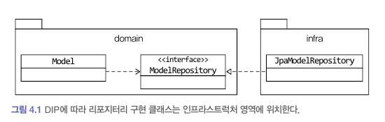
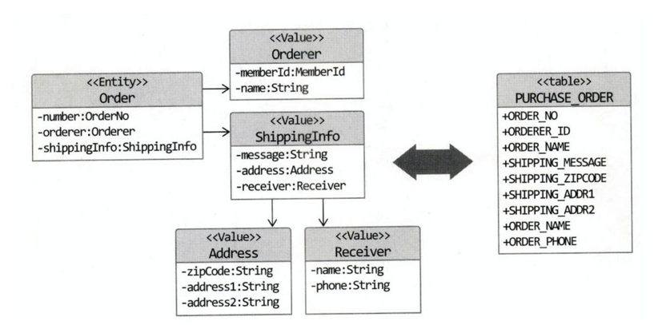

# JPA를 이용한 Repository 구현

## 모듈 위치


## Repository 기본 기능 구현
- ID로 Aggregate 조회하기
- Aggregate 저장하기

```java
public interface OrderRepository {
    Optional<Order> findById(OrderNo id);
    void save(Order order);
}
```

# Mapping 구현


## Entity와 Value 매핑 : @Entity, @Embeddable, @Embedded
- Aggregate Root는 Entity이므로, `@Entity`로 매핑한다.
- Value는 `@Embeddable`로 매핑한다.
- Value 타입의 프로퍼티는 `@Embedded`로 매핑한다.

```java
import com.myshop.order.command.domain.Receiver;
import com.myshop.order.command.domain.ShippingInfo;
import javax.persistence.Embedded;

@Entity
@Table(name = "ORDERS")
public class Order {
    // ...

    @Embedded
    private Orderer orderer;

    @Embedded
    private ShippingInfo shippingInfo;
}
```

```java
@Embeddable
public class Orderer {
    
    @Embedded
    @AttributeOverrides(
        @AttributeOverride(name = "id", column = @Column(name = "ORDERER_ID"))
    )
    private MemberId memberId;

    @Column(name = "ORDERER_NAME")
    private String name;
}
```

```java
@Embeddable
public class MemberId implements Serializable {

    @Column(name = "MEMBER_ID")
    private String id;
}
```

```java
@Embeddable
public class ShippingInfo {

    @Embedded
    @AttributeOverrides({
        @AttributeOverride(name = "zipCode", column = @Column(name = "SHIPPING_ZIP_CODE")),
        @AttributeOverride(name = "address1", column = @Column(name = "SHIPPING_ADDRESS1")),
        @AttributeOverride(name = "address2", column = @Column(name = "SHIPPING_ADDRESS2"))
    })
    private Address address;

    @Column(name = "SHIPPING_MESSAGE")
    private String message;
    
    @Embedded
    private Receiver receiver;
}
```

## JPA를 위한 기본 생성자
- JPA에서 `@Entity`와 `@Embeddable`로 Class를 매핑하려면, 기본 생성자가 있어야 한다.
- 따라서 가급적이면 `protected` 혹은 패키지 범위로 기본 생성자를 선언하는 것을 추천한다.

```java
import javax.persistence.Column;

@Embeddable
@NoArgsConstructor(access = AccessLevel.PROTECTED)
public class Receiver {

    @Column(name = "RECEIVER_NAME")
    private String name;

    @Column(name = "RECEIVER_PHONE")
    private String phone;
    
    public Receiver(String name, String phone) {
        this.name = name;
        this.phone = phone;
    }
}
```

## AttributeConverter를 이용한 Value 매핑 처리 : @Convert, @Converter
- AttributeConverter를 구현하고, `@Convert`, `@Converter`를 이용해서 Value 타입을 매핑한다.
- `@Converter(autoApply = true)`를 이용하면, 모든 Entity에 대해 자동으로 매핑한다.

```java
public interface AttributeConverter<X, Y> {
    Y convertToDatabaseColumn(X var1);

    X convertToEntityAttribute(Y var1);
}
```

## Value Collection : 별도 테이블로 매핑
- Value Collection을 별도의 테이블로 매핑하려면, `@ElementCollection`과 `@CollectionTable`을 이용한다.

```java
import javax.persistence.CollectionTable;
import javax.persistence.ElementCollection;
import javax.persistence.OrderColumn;

@Entity
@Table(name = "ORDERS")
public class Order {

    @EmbeddedId
    private OrderNo number;

    @ElementCollection
    @CollectionTable(name = "ORDER_LINES", joinColumns = @JoinColumn(name = "ORDER_NUMBER"))
    @OrderColumn(name = "LINE_IDX")
    private List<OrderLine> orderLines;
    
    // ...
}
```

```java
import javax.persistence.Column;
import javax.persistence.Embeddable;
import javax.persistence.Embedded;

@Embeddable
public class OrderLine {

    @Embedded
    private ProductId productId;

    @Column(name = "PRICE")
    private Money price;
    
    @Column(name = "QUANTITY")
    private int quantity;
    
    @Column(name = "AMOUNTS")
    private Money amounts;
    
    // ...
}
```

### @ElementCollection
```java
public @interface ElementCollection {
    Class targetClass() default void.class;

    FetchType fetch() default FetchType.LAZY;
}
```

### @CollectionTable
```java
public @interface CollectionTable {
    String name() default "";

    String catalog() default "";

    String schema() default "";

    JoinColumn[] joinColumns() default {};

    ForeignKey foreignKey() default @ForeignKey(ConstraintMode.PROVIDER_DEFAULT);

    UniqueConstraint[] uniqueConstraints() default {};

    Index[] indexes() default {};
}
```

## Value Collection : 한 개 칼럼으로 매핑
- Value Collection을 Wrapping하는 Value 클래스를 선언하고,
  - AttributeConverter를 활용하면, Value Collection을 한 개 칼럼으로 매핑할 수 있다.

## Value를 이용한 ID 매핑 : @EmbeddedId, @Embeddable
- 식별자 자체를 Value 타입으로 만들수 있다.
- `@EmbeddedId`와 `@Embeddable`을 이용해서 식별자를 Value 타입으로 매핑한다.
- 식별자로 사용할 Value 타입은 다음과 같은 조건을 만족해야 한다.
  - `Serializable`을 구현해야 한다.
  - `equals()`와 `hashCode()`를 구현해야 한다.

```java
import javax.persistence.Table;

@Entity
@Table(name = "ORDERS")
public class Order {

    @EmbeddedId
    private OrderNo number;

    // ...
}
```

```java
@Embeddable
public class OrderNo implements Serializable {

    @Column(name = "ORDER_NUMBER")
    private String number;
    
    private boolean is2ndGeneration() {
        return number.startsWith("N");
    }
}
```

## Value Collection을 @Entity로 매핑
- 다음과 같은 기능을 사용하여, Value Collection을 `@Entity`로 매핑할 수 있다. 
  - `@Inheritance`
  - `@DiscriminatorColumn`
  - `@OneToMany(cascade = {CascadeType.PERSIST, CascadeType.REMOVE}, orphanRemoval = true)`

### 단점
- Value Collection의 clear 메서드를 호출하면, 모든 데이터를 select 쿼리로 조회한 뒤, 각 개별 Entity에 대해 delete 쿼리를 실행한다.
  - 반면, `@Embeddable`을 통해서 매핑한다면, 단순히 delete 쿼리만 실행한다.

## ID 참조와 Join 테이블을 이용한 단방향 M-N 매핑

```java
import javax.persistence.Column;
import javax.persistence.Embedded;
import javax.persistence.EmbeddedId;
import javax.persistence.Table;

@Entity
@Table(name = "PRODUCT")
public class Product {

  @EmbeddedId
  private ProductId id;

  @ElementCollection
  @CollectionTable(
      name = "PRODUCT_CATEGORY", 
      joinColumns = @JoinColumn(name = "PRODUCT_ID")
  )
  private Set<CategoryId> cartegoryIds;
}
```

# Aggregate 로딩 전략

# Aggregate 영속성 전파

# 
