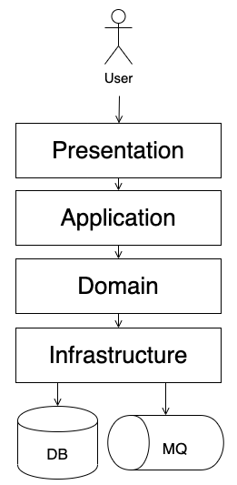

# Domain이란?
> 소프트웨어로 해겨하고자 하는 문제 영역

- 한 하위 도메인은 다른 하위 도메인과 연동하여 완전한 기능을 제공할 수 있다.
- 특정 도메인이 제공해야할 모든 기능을 직접 구현하는 것은 아니다.
  - 외부 서비스를 이용할 수도 있다.
- 도메인 마다 고정된 하위 도메인이 존재하는 것은 아니다.

# 도메인 전문가와 개발자 간 지식 공유
- 요구사항을 올바르게 이해하는 것이 중요하다.
- 도메인 전문가와 개발자는 도메인에 대한 지식을 공유해야 한다.

# 도메인 모델
> 특정 도메인을 개념적으로 표현한 것

- 여러 관계자들이 동일한 모습으로 도메인을 이해하고 도메인 지식을 공유하는 데 도움이 된다.

## 하위 도메인과 모델
- 도메인은 다수의 하위 도메인으로 구성된다.
- 각 하위 도메인이 다루는 영역은 서로 다르기 때문에 같은 용어라도 하위 도메인마다 의미가 다를 수 있다.
  - 각 하위 도메인마다 별도로 모델을 만들어야 한다.

# 도메인 모델 패턴
- 일반적으로 Application 아키텍처는 다음과 같이 4개의 영역으로 구성된다.
  - `Presentation` : 사용자의 요청을 처리하고 사용자에게 정보를 보여준다.
  - `Application` : 사용자가 요청한 기능을 실행한다.
  - `Domain` : 시스템이 제공할 도메인의 규칙을 구현한다.
  - `Infrastructure` : 데이터베이스나 메시징 시스템과 같은 외부 시스템과의 연동을 처리한다.



```java
public class Order {

  private OrderState state;
  private ShippingInfo shippingInfo;

  public void changeShippingInfo(ShippingInfo newShippingInfo) {
    if (!state.isShippingChangeable()) {
      throw new IllegalStateException("can't change shipping in " + state);
    }
    this.shippingInfo = newShippingInfo;
  }
  
  private boolean isShippingChangeable() {
    return state == OrderState.PAYMENT_WAITING || state == OrderState.PREPARING;
  }
}

public enum OrderState {
    PAYMENT_WAITING, PREPARING, SHIPPED, DELIVERING, DELIVERY_COMPLETED;
}
```
# Entity, Value
- 도메인 모델을 구현할 때는 Entity와 Value를 구분해서 구현해야 한다.
- Entity는 식별자를 가지며 동일성을 비교할 수 있다.
- Value는 식별자가 없으며 동일성을 비교할 수 없다.

## Entity
- 식별자를 가지며 동일성을 비교할 수 있다.
- Entity를 구현한 클래스는 식별자를 이용해서 `equals()` 메서드와 `hashCode()` 메서드를 구현할 수 있다.

### Entity의 식별자 생성
- Entity의 식별자를 생성하는 시점은 도메인의 특징과 사용하는 기술에 따라 달라진다.
- 주로 다음과 같은 방식으로 생성한다.
  - 특정 규칙에 따라 생성
  - UUID나 Nano ID와 같은 고유 식별자 생성기 사용
  - 값을 직접 입력
  - 일련번호 사용 (DB의 시퀀스나 자동 증가 컬럼 사용)

```java
UUID uuid = UUID.randomUUID();

// 6c84fb90-12c4-11e1-840d-7b25c5ee775a 과 같은 형식의 문자열
String stringUUID = uuid.toString();
```

## Value
- 식별자를 가지지 않는다.
- 데이터 변경 기능을 제공하지 않는 `Immutable`로 구현하는 것이 가장 좋다.
- 두 개의 Value 객체를 비교할 때는, 모든 속성이 같은지 비교한다.

## 도메인 모델에 set 메서드 넣지 않기
- 도메일 모델에 get/set 메서드를 무조건 추가하는 것은 좋지 않다.
  - 모데인의 핵심 개념이나 의도를 코드에서 사라지게 한다.
- 도메인 객체가 불완전한 상태로 사용되는 것을 막으려면,
  - 생성 시점에 필요한 데이터를 모두 전달해 주어야 한다.
  - 즉, 생성자를 통해 필요한 데이터를 모두 받아야 한다.

## 도메인 용어와 유비쿼터스 언어
- 최대한 도메인 용어를 사용해서 코드를 구현해야 한다.
- 도메인 용어를 사용하면 코드를 읽는 사람이 도메인을 이해하기 쉽다.


