# 네 개의 영역
- 아키텍처를 설계할 때 출현하는 전형적인 4가지 영역은 다음과 같다.
  - `Presentation` 
  - `Application`
  - `Domain`
  - `Infrastructure`

## Presentation - Application
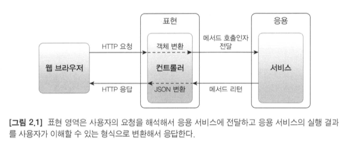

- `Presentation` 영역은 HTTP 요청을 `Application` 영역이 필요로 하는 형식으로 변환해서 전달하고, 
  - `Application` 영역의 응답을 HTTP 응답으로 변환하여 전송한다.

## Application - Domain
> `Application` 서비스는 로직을 직접 수행하기보다는 `Domain` 모델에 로직 수행을 위임한다.

- `Application` 영역은 `Domain` 모델을 사용해서 기능을 구현하고 실행한다.

```java
public class CancelOrderService {

    @Transactional
    public void cancelOrder(String orderId) {
        Order order = orderRepository.findById(orderId)
            .orElseThrow(() -> new OrderNotFoundException(orderId));
        
        order.cancel();
    }
}
```

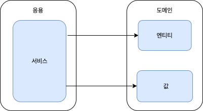

## Infrastructure
- `Infrastructure` 영역은 구현 기술에 대한 것을 다룬다.
- `Domain`, `Application`, `Presentation` 영역은 구현 기술을 사용한 코드를 직접 만들지 않는다.
  - 대신 `Infrastructure` 영역에서 제공하는 인터페이스를 사용한다.
- `Infrastructure` 영역은 `Domain`, `Application`, `Presentation` 영역의 기능을 실행하기 위한 구현 기술을 선택하고 구현한다.

### Infrastructure 사용 예시
- `Application` 영역에서 DB에 보관된 데이터가 필요하면,
  - `Infrastructure` 영역에서 제공하는 DB 연동 모듈을 이용해서 데이터를 조회한다.
- `Application` 영역에서 외부에 메일을 전송해야 한다면,
  - `Infrastructure` 영역에서 제공하는 SMTP 연동 모듈을 이용해서 메일을 전송한다.

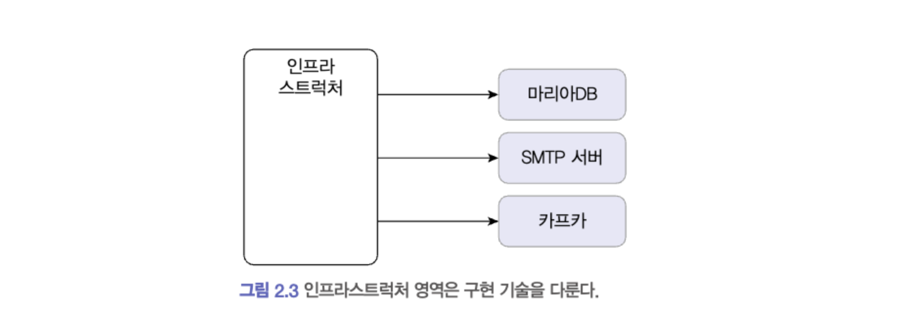

# 계층 구조 아키텍처
- `Presentation`, `Application`, `Domain`, `Infrastructure` 영역을 구성할 때 많이 사용하는 아키텍처가 아래 그림과 같다.
  - `Presentation`, `Application` 영역은 `Domain` 영역을 사용한다.
  - `Domain` 영역은 `Infrastructure` 영역을 사용한다.
- 도메인의 복잡도에 따라 `Application`, `Domain`을 분리하기도 하고 합치기도 한다.
- 계층 구조는 상위 계층에서 하위 계층으로의 의존만 존재한다.
  - 하위 계층은 상위 계층에 의존하지 않는다.

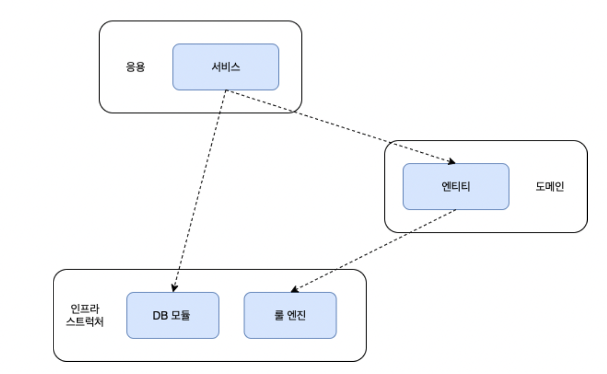

## Infrastructure 계층 의존시, 발생할 수 있는 문제점
- `Infrastructure` 계층에 직접 의존할 경우, 아래와 같은 2가지 문제점이 발생한다.
  - 테스트 하기가 어렵다.
  - 구현 방식을 변경하기가 어렵다.
- 위와 같은 문제점을 해결 방법은 <u>**DIP(Dependency Inversion Principle)**</u>를 적용하는 것이다.

```java
@RequiredArgsConstructor
public class CalculateDiscountService {
    private final DroolsRuleEngine ruleEngine;  // Infrastructure 모듈
  
    public Money calculateDiscount(Order order) {
        // ...
        val result = ruleEngine.run();
        // ...
    }
}
```

# DIP
- 고수준 모듈이 실제 구현을 위해서는 저수준 모듈을 사용해야 한다.
- 하지만 고수준 모듈이 저수준 모듈을 직접 사용하면, 문제점이 발생한다.
  - 테스트 하기 어렵다.
  - 구현 방식을 변경하기가 어렵다.
- 이 문제를 해결하기 위해, 저수준 모듈이 고수준 모듈에 의존하도록 바꾼다.
  - 고수준 모듈은 여러 저수준 모듈이 제공하는 인터페이스를 정의한다.

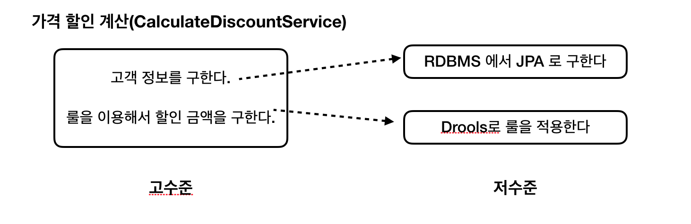

## DIP 적용을 위한 저수준 모듈 추상화
- 저수준 모듈이 제공하는 기능에 대해 고수준 모듈에서 인터페이스를 정의한다.
- 저수준 모듈은 고수준 모듈이 제공한 인터페이스를 구현한다.
- 이를 통해, 고수준 모듈은 저수준 모듈에 의존하지 않는다.
  - 고수준 모듈의 컴포넌트를 생성할 때, 실제 의존할 구현 객체는 외부에서 주입할 수 있다.
    - Spring의 DI(Dependency Injection) 기능을 이용하면, 쉽게 구현체 선택을 변경할 수 있다.

```java
public interface RuleDiscounter {
    Money applyRules(Customer customer, List<OrerLine> orderLines);
}
```

```java
@RequiredArgsConstructor
public class CalculateDiscountService {
  private final RuleDiscounter ruleDiscounter;  // 저수준 모듈 기능을 추상화한 인터페이스 (고수준 모듈에 포함)
  private final CustomerRepository customerRepository;

  public Money calculateDiscount(Order order) {
    Customer customer = customerRepository.findById(customerId)
        .orElseThrow(() -> new CustomerNotFoundException(customerId));
    // ...
    return ruleDiscounter.applyRules(customer, orderLines);
  }
}
```
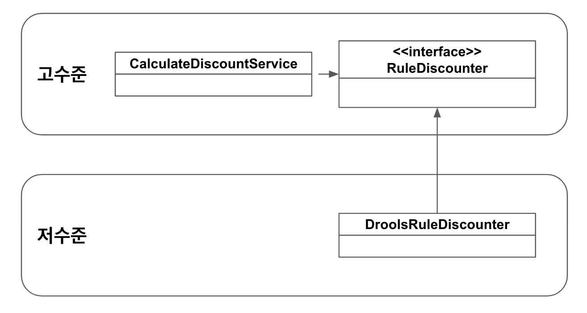

## DIP 적용을 통한 테스트 코드 (Mocking Test)
- 아래 코드와 같이 저수준 모듈의 실제 구현체 없이 테스트를 진행할 수 있다.
  - **DIP 적용을 통해 고수준 모듈이 저수준 모듈에 의존하지 않기 때문이다.**
```java
public class CalculateDiscountServiceTest {
    @Test
  public void noCustomer_thenExceptionShouldBeThrown() {
        // 테스트 목적의 mock 객체 생성
        CustomerRepository customerRepository = mock(CustomerRepository.class);
        when(customerRepository.findById(anyString())).thenReturn(Optional.empty());
        
        RuleDiscounter ruleDiscounter = (customer, orderLines) -> Money.ZERO;
        
        // mock 객체 주입후, 테스트 진행 
        CalculateDiscountService calculateDiscountService = new CalculateDiscountService(ruleDiscounter, customerRepository);
        
        assertThrows(CustomerNotFoundException.class, () -> {
            calculateDiscountService.calculateDiscount(order);
        });
    }
}
```

## DIP 주의사항
> DIP를 잘못 생각하면 단순히 인터페이스와 구현 클래스를 분리하는 것으로 오해할 수 있다.
> 
> 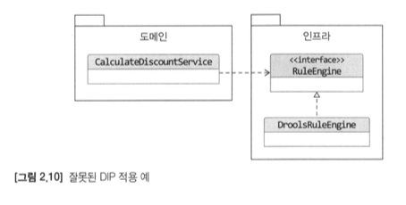
> 
> **DIP의 핵심은 고수준 모듈이 저수준 모듈에 의존하지 않도록 하기 위함이다.**

- DIP를 적용할 때 하위 기능을 추상화한 인터페이스는 고수준 모듈에 위치해야 한다.

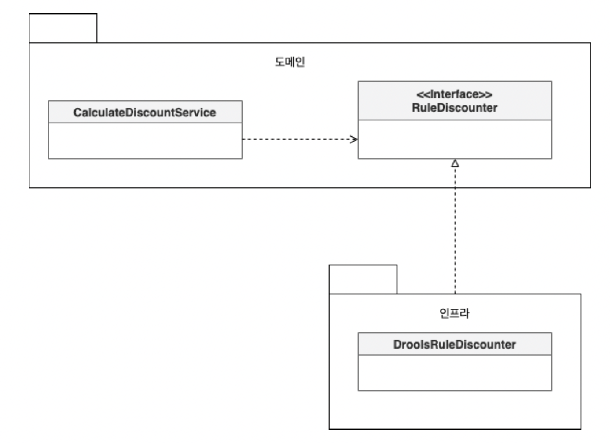

## DIP와 아키텍처
- `Infrastruture` 영역은 구현 기술을 다루는 저수준 모듈이고,
- `Application`, `Domain` 영역은 고수준 모듈이다.
- 계층형 구조 아키텍처와 달리 DIP를 적용하면, 
  - 다음과 같이 `Infrastructure` 영역이 `Application`, `Domain` 영역에 의존(상속)하는 구조가 된다.

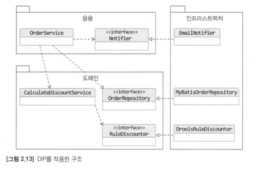

- `Infrastructure`에 위치한 클래스가 `Domain`이나 `Application` 영역에서 정의한 인터페이스를 상속받아 구현하는 구조가 되므로,
  - `Domain`과 `Application` 영역에 대한 영향을 최소화하면서 구현체를 변경하거나 추가할 수 있다.

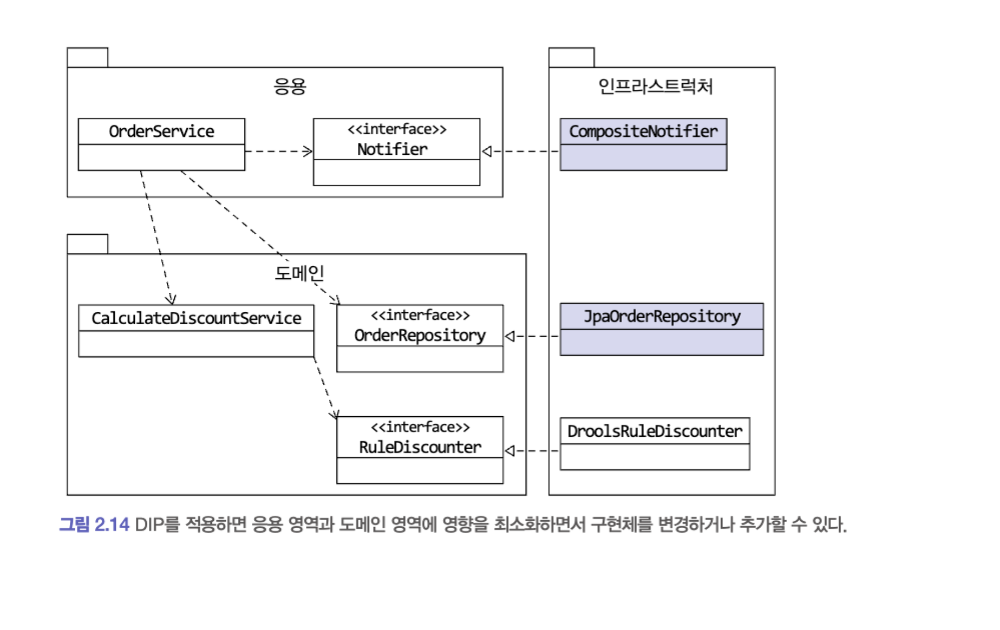

# 도메인 영역의 주요 구성 요소
- 도메인 영역은 다음과 같은 구성 요소로 구성된다.
  - `Entity`
  - `Value`
  - `Aggregate`
  - `Repository`
  - `Domain Service`

## Entity
- 고유의 식별자를 갖는 개체로 자신의 라이프 사이클을 갖는다. 
- 주문, 회원, 상품과 같이 도메인의 고유한 개념을 표현한다. 
- 도메인 모델의 데이터를 포함하며 해당 데이터와 관련된 기능을 함께 제공한다.

```java
import com.myshop.order.command.domain.ShippingInfo;

public class Order {

  // 주문 도메인 모델의 데이터 
  private OrderNo number;
  private Orderer orderer;
  private ShippingInfo shippingInfo;

  // 도메인 모델 Entity는 도메인 기능도 함께 제공
  public void changeShippingInfo(ShippingInfo shippingInfo) {
      // ...
  }
}
```

### `도메인 모델의 Entity`, `DB 모델의 Entity` 차이점
- `도메인 모델의 Entity`는 데이터화 함께 도메인 기능을 함께 제공한다.
  - `DB 모델의 Entity`는 단순히 데이터를 저장하기 위한 용도로 사용된다.
- `도메인 모델의 Entity`는 도메인 관점에서 기능을 구현하고 기능 구현을 캡슐화한다.
  - 데이터가 임의로 변경되는 것을 막는다.

## Value
- 고유의 식별자를 갖지 않는 개체로 주로 개념적으로 하나인 값을 표현할 때 사용된다. 
- 배송지 주소를 표현하기 위한 주소나 구매 금액을 위한 금액과 같은 타입이 Value 타입이다. 
- 엔티티의 속성으로 사용할 뿐만 아니라 달느 밸류 타입의 속성으로도 사용할 수 있다.
- **Value 타입은 불변으로 구현하는 것을 권장한다.**
  - Value 타입 데이터를 변경할 때는 객체 자체를 완전히 교체

## Aggregate
- `Aggregate`는 관련 객체를 하나로 묶은 군집이다.

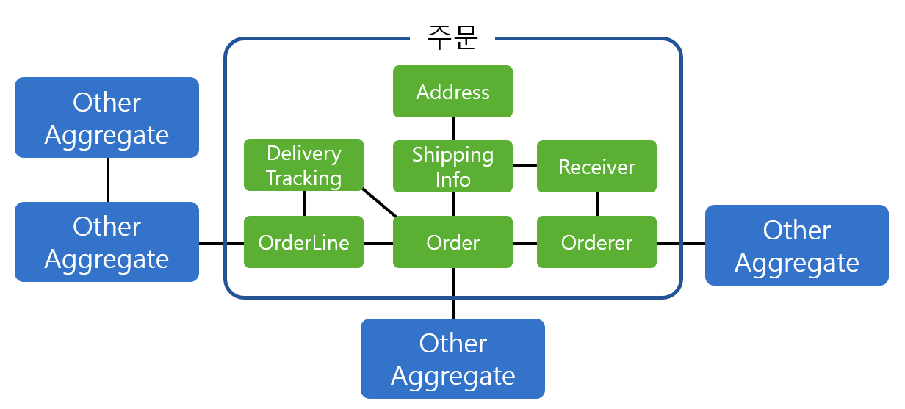

## Repository
- `Repository`는 도메인 객체를 저장하고 조회하는 기능을 정의한다.
  - `Aggregate`를 저장하는 메서드
  - `Aggregate`를 루트 식별자로 조회하는 메서드
  - ...
- `Application` 영역과 `Repository`는 밀접한 연관이 있다.
  - `Application` 영역은 `Repository`를 사용해서 도메인 객체를 저장하고 조회한다.
  - `Application` 영역은 Transaction을 관리하는데, 
    - Transaction 처리는 `Repository` 구현 기술의 영향을 받는다.

# 요청 처리 흐름
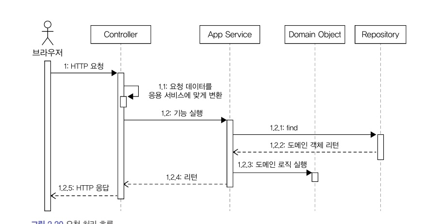
